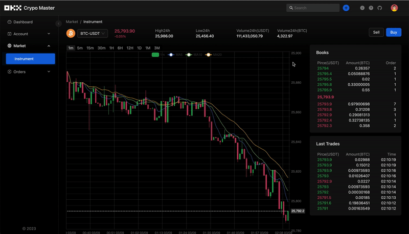
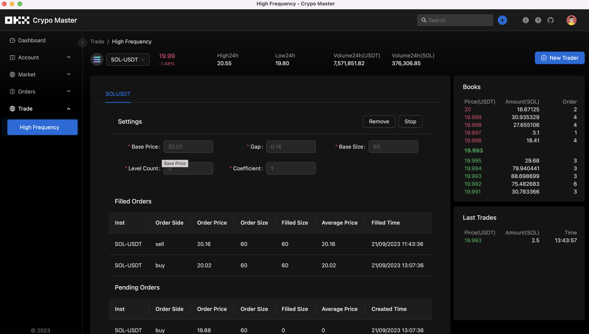

# OKX App

A automatical crypto currency trading application, by electron + typescript. Based on [okx-node](https://github.com/hsuehic/okx-node)

## Screenshot

## Troubleshooting

- Electron forge doesn't support `pnpm`. For `make`, `package`, we need to install dependencies using `npm`;
